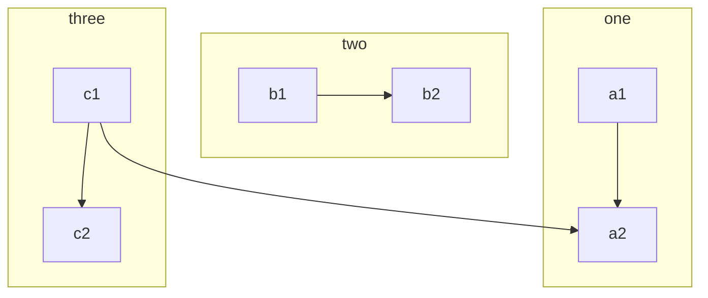
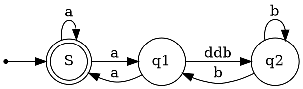

# 图表类特殊支持

> 下面所有的示例均来源于`vditor`提供的示例，强烈不建议在屏幕尺寸宽度小于1024px的设备上使用

## 思维导图

````markdown
```mindmap
- 教程
    - 部分一
        - 章节一
        - 章节二
    - 部分二
```
````

```mindmap
- 教程
    - 部分一
        - 章节一
        - 章节二
    - 部分二
```

## mermaid

````markdown

````


## echarts图表

````markdown
```echarts
{
  "title": { "text": "最近 30 天" },
  "tooltip": { "trigger": "axis", "axisPointer": { "lineStyle": { "width": 0 } } },
  "legend": { "data": ["帖子", "用户", "回帖"] },
  "xAxis": [{
      "type": "category",
      "boundaryGap": false,
      "data": ["2019-05-08","2019-05-09","2019-05-10","2019-05-11","2019-05-12","2019-05-13","2019-05-14","2019-05-15","2019-05-16","2019-05-17","2019-05-18","2019-05-19","2019-05-20","2019-05-21","2019-05-22","2019-05-23","2019-05-24","2019-05-25","2019-05-26","2019-05-27","2019-05-28","2019-05-29","2019-05-30","2019-05-31","2019-06-01","2019-06-02","2019-06-03","2019-06-04","2019-06-05","2019-06-06","2019-06-07"],
      "axisTick": { "show": false },
      "axisLine": { "show": false }
  }],
  "yAxis": [{ "type": "value", "axisTick": { "show": false }, "axisLine": { "show": false }, "splitLine": { "lineStyle": { "color": "rgba(0, 0, 0, .38)", "type": "dashed" } } }],
  "series": [
    {
      "name": "帖子", "type": "line", "smooth": true, "itemStyle": { "color": "#d23f31" }, "areaStyle": { "normal": {} }, "z": 3,
      "data": ["18","14","22","9","7","18","10","12","13","16","6","9","15","15","12","15","8","14","9","10","29","22","14","22","9","10","15","9","9","15","0"]
    },
    {
      "name": "用户", "type": "line", "smooth": true, "itemStyle": { "color": "#f1e05a" }, "areaStyle": { "normal": {} }, "z": 2,
      "data": ["31","33","30","23","16","29","23","37","41","29","16","13","39","23","38","136","89","35","22","50","57","47","36","59","14","23","46","44","51","43","0"]
    },
    {
      "name": "回帖", "type": "line", "smooth": true, "itemStyle": { "color": "#4285f4" }, "areaStyle": { "normal": {} }, "z": 1,
      "data": ["35","42","73","15","43","58","55","35","46","87","36","15","44","76","130","73","50","20","21","54","48","73","60","89","26","27","70","63","55","37","0"]
    }
  ]
}
```
````

```echarts
{
  "title": { "text": "最近 30 天" },
  "tooltip": { "trigger": "axis", "axisPointer": { "lineStyle": { "width": 0 } } },
  "legend": { "data": ["帖子", "用户", "回帖"] },
  "xAxis": [{
      "type": "category",
      "boundaryGap": false,
      "data": ["2019-05-08","2019-05-09","2019-05-10","2019-05-11","2019-05-12","2019-05-13","2019-05-14","2019-05-15","2019-05-16","2019-05-17","2019-05-18","2019-05-19","2019-05-20","2019-05-21","2019-05-22","2019-05-23","2019-05-24","2019-05-25","2019-05-26","2019-05-27","2019-05-28","2019-05-29","2019-05-30","2019-05-31","2019-06-01","2019-06-02","2019-06-03","2019-06-04","2019-06-05","2019-06-06","2019-06-07"],
      "axisTick": { "show": false },
      "axisLine": { "show": false }
  }],
  "yAxis": [{ "type": "value", "axisTick": { "show": false }, "axisLine": { "show": false }, "splitLine": { "lineStyle": { "color": "rgba(0, 0, 0, .38)", "type": "dashed" } } }],
  "series": [
    {
      "name": "帖子", "type": "line", "smooth": true, "itemStyle": { "color": "#d23f31" }, "areaStyle": { "normal": {} }, "z": 3,
      "data": ["18","14","22","9","7","18","10","12","13","16","6","9","15","15","12","15","8","14","9","10","29","22","14","22","9","10","15","9","9","15","0"]
    },
    {
      "name": "用户", "type": "line", "smooth": true, "itemStyle": { "color": "#f1e05a" }, "areaStyle": { "normal": {} }, "z": 2,
      "data": ["31","33","30","23","16","29","23","37","41","29","16","13","39","23","38","136","89","35","22","50","57","47","36","59","14","23","46","44","51","43","0"]
    },
    {
      "name": "回帖", "type": "line", "smooth": true, "itemStyle": { "color": "#4285f4" }, "areaStyle": { "normal": {} }, "z": 1,
      "data": ["35","42","73","15","43","58","55","35","46","87","36","15","44","76","130","73","50","20","21","54","48","73","60","89","26","27","70","63","55","37","0"]
    }
  ]
}
```

## 五线谱

````markdown
```abc
X: 24
T: Clouds Thicken
C: Paul Rosen
S: Copyright 2005, Paul Rosen
M: 6/8
L: 1/8
Q: 3/8=116
R: Creepy Jig
K: Em
|:"Em"EEE E2G|"C7"_B2A G2F|"Em"EEE E2G|\
"C7"_B2A "B7"=B3|"Em"EEE E2G|
"C7"_B2A G2F|"Em"GFE "D (Bm7)"F2D|\
1"Em"E3-E3:|2"Em"E3-E2B|:"Em"e2e gfe|
"G"g2ab3|"Em"gfeg2e|"D"fedB2A|"Em"e2e gfe|\
"G"g2ab3|"Em"gfe"D"f2d|"Em"e3-e3:|
```
````

```abc
X: 24
T: Clouds Thicken
C: Paul Rosen
S: Copyright 2005, Paul Rosen
M: 6/8
L: 1/8
Q: 3/8=116
R: Creepy Jig
K: Em
|:"Em"EEE E2G|"C7"_B2A G2F|"Em"EEE E2G|\
"C7"_B2A "B7"=B3|"Em"EEE E2G|
"C7"_B2A G2F|"Em"GFE "D (Bm7)"F2D|\
1"Em"E3-E3:|2"Em"E3-E2B|:"Em"e2e gfe|
"G"g2ab3|"Em"gfeg2e|"D"fedB2A|"Em"e2e gfe|\
"G"g2ab3|"Em"gfe"D"f2d|"Em"e3-e3:|
```

## Graphviz

````markdown

````


## [基础语法](/p/md)
