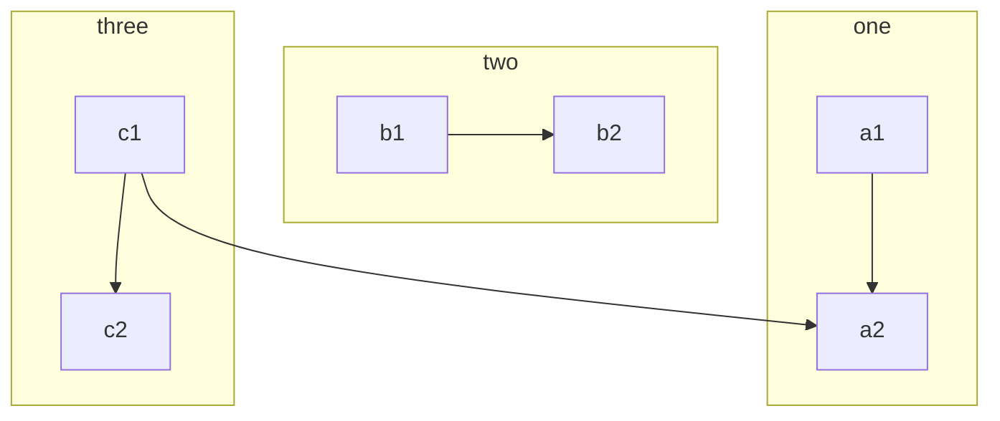
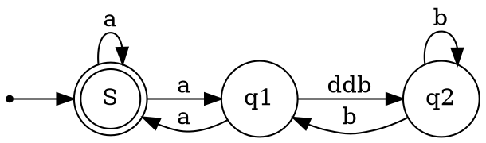

# Markdown及拓展语法

> 本站编辑器基于开源编辑器`vditor`，尽可能适配最新的`vditor`支持的语法；请尽量使用优雅、通用的markdown语法

## 基础语法

### 标题

| 名称     | 写法              |
| -------- | ----------------- |
| 一级标题 | `# 一级标题`      |
| 二级标题 | `## 二级标题`     |
| 三级标题 | `### 三级标题`    |
| 四级标题 | `#### 四级标题`   |
| 五级标题 | `##### 五级标题`  |
| 六级标题 | `###### 六级标题` |

### 段落

空行分割文本自动为段落

### 折行

使用`<br>`标签实现换行

### 文本加粗与强调

| 名称       | 写法               |
| ---------- | ------------------ |
| 加粗       | `**加粗**`         |
| 强调       | `*强调*`           |
| 加粗并强调 | `***加粗与强调***` |

### 块引用

- `> 块引用` 的语法可以实现引用
- `>> 引用嵌套` 的语法可以实现引用的嵌套
- 引用块里可以嵌套其他语法

渲染结果

> 块引用
>> 引用嵌套

### 列表

强烈建议不使用`*`来创建无序列表，可以使用`-`来替代

#### 有序列表

`1. item 1`<br>`2. item 2`<br>`3. item 3`

1. item 1
2. item 2
3. item 3

#### 无序列表

`- item`<br>`- item`<br>`- item`

- item
- item
- item

### 代码块与行内代码

- 使用 \`代码\` 的语法在文本中可以实现行内代码，例如 `var a = 0`
- 使用下述语法实现代码块

````md
```语言类型
代码内容
```
````

```js
console.log("Hello  World!")
```

### 分割线

使用超过三个的`*`来定义分割线

### 超链接

#### 超链接文字

使用`[文字](链接)`的方式来定义超链接的文字[GitHub](https://www.github.com)

#### URL和邮箱地址

如果要直接显示 URL 或者邮件地址，可以使用`<`和`>`包裹链接地址 <https://github.com>

#### 引用风格的超链接

> 直接使用超链接，不使用引用风格这部分可以跳过

`[链接文本][链接标识]`<br>
`[链接标识]: 链接内容`

#### 链接的定义

使用`[链接标识]: 链接内容`语法来定义链接

### 图片

使用``的方式可以用来加载图片，例如

#### 带有跳转的图片

使用`](图片地址)`的嵌套可以实现

### 转义字符

使用`\`可以转义下面的字符

| 字符 |
| ---- |
| `\`  |
| \`   |
| `*`  |
| `_`  |
| `{}` |
| `[]` |
| `()` |
| `#`  |
| `-`  |
| `+`  |
| `!`  |
| `.`  |
| `\|` |

几乎所有的ASCII码符号都可以使用反斜杠来转义

### 嵌入HTML

markdown原生支持嵌入HTML

## 拓展语法

> `vditor`支持部分非标准的markdown的拓展语法，不同的markdown编辑器对于拓展语法的支持程度不同，其他编辑器不一定能支持这些语法；同理，部分其他编辑器的语法在`vditor`也不支持。vscode可以使用`vscode-md`这个插件来对于`vditor`支持的语法进行渲染，但是其占用了`.md`文件的渲染，常规语法还是使用`Markdown All in One`这个插件更加稳妥。

### 表格

`| 表格头 | 表格头 |`<br>
`| --- | --- |`<br>
`| 表格内容 | 表格内容 |`<br>

渲染结果

| 表格头   | 表格头   |
| -------- | -------- |
| 表格内容 | 表格内容 |

- 第二行的`-`需要超过三个
- 使用`:---`左对齐表格内容, `---:`右对齐表格内容

### 脚注

> 此部分来源于`vditor`提供的markdown教程，脚注这一部分非常麻烦，并且再不同的渲染器中表现差异比较大

脚注用于在文末添加细节说明或者参考，这样文章的正文部分看上去会更加简洁清晰。创建脚注后，正文中引用脚注的地方会出现一个上标数字链接，读者点击后跳转到文末脚注定义的对应位置。

脚注引用通过 `[^标识符]` 创建，标识符部分可以是数字或者文本，但不能包含空格或者制表符。标识符仅用于关联引用和定义，在渲染时会自动根据脚注定义顺序进行数字递增渲染。不过这也不是绝对的，某些 Markdown 引擎也会将标识符部分用于渲染。

脚注定义使用 `[^标识符]`: 来创建，冒号后面就是需要添加的细节说明或者参考。脚注定义不一定非要放在整个 Markdown 文本的末尾，夹在段落、列表或者块引用之间也是可以工作的。

```markdown
这里是一个脚注引用[^1]，这里是另一个脚注引用[^bignote]。

[^1]: 第一个脚注定义。
[^bignote]: 脚注定义可使用多段内容。
```

渲染结果

这里是一个脚注引用[^1]，这里是另一个脚注引用[^bignote]。

[^1]: 第一个脚注定义。
[^bignote]: 脚注定义可使用多段内容。

### 链接到指定标题

可以使用`[文字](#标题)`的方式通过锚点跳转到指定的标题

### 删除线

使用`~~删除的文字~~`的语法来实现删除的效果~~删除的文字~~

### checkbox

使用下面的语法实现checkbox

`- [ ] 事项一`<br>
`- [x] 事项二`<br>
`- [ ] 事项三`<br>

- [ ] 事项一
- [x] 事项二
- [ ] 事项三

### 折叠块

```markdown
<details>
<summary>这里是摘要部分。</summary>
这里是细节部分。
</details>
```

<details>
<summary>这里是摘要部分。</summary>
这里是细节部分。
</details>

### emoji表情

这个很多的编辑器并不支持，或者差异较大。可以通过直接输入emoji表情，或者短码 `:sunny:` 的方式，直接输入需要编辑器使用utf-8编码

:sunny: :cn: :girl: :jp:

### 数学公式

> 默认使用KaTex进行渲染

使用`$a^2 + b^2 = c^2$`可以实现支持行内数学公式$a^2 + b^2 = c^2$

使用下述语法可以实现对于公式块的渲染

```markdown
$$
\nabla \times H = J + \frac{\partial D}{\partial t} \newline
\nabla \times E = - \frac{\partial B}{\partial t} \newline
\nabla \cdot B = 0 \newline
\nabla \cdot D = \rho
$$
```

$$
\nabla \times H = J + \frac{\partial D}{\partial t} \newline
\nabla \times E = - \frac{\partial B}{\partial t} \newline
\nabla \cdot B = 0 \newline
\nabla \cdot D = \rho
$$

### 多媒体

> `vditor`自动对HTML支持的媒体文件进行解析

视频demo

http://chimee.org/vod/1.mp4

音频demo

http://stor.cloudmusics.cn/mp3/2020/01/727f6d5495b821b2c87d70c29a83a4d9.mp3http://stor.cloudmusics.cn/mp3/2020/01/727f6d5495b821b2c87d70c29a83a4d9.mp3

# 图表类特殊支持

> 下面所有的示例均来源于`vditor`提供的示例，强烈不建议在屏幕尺寸宽度小于1024px的设备上使用

## 思维导图

````markdown
```mindmap
- 教程
    - 部分一
        - 章节一
        - 章节二
    - 部分二
```
````

```mindmap
- 教程
    - 部分一
        - 章节一
        - 章节二
    - 部分二
```

## mermaid

````markdown

````


## echarts图表

````markdown
```echarts
{
  "title": { "text": "最近 30 天" },
  "tooltip": { "trigger": "axis", "axisPointer": { "lineStyle": { "width": 0 } } },
  "legend": { "data": ["帖子", "用户", "回帖"] },
  "xAxis": [{
      "type": "category",
      "boundaryGap": false,
      "data": ["2019-05-08","2019-05-09","2019-05-10","2019-05-11","2019-05-12","2019-05-13","2019-05-14","2019-05-15","2019-05-16","2019-05-17","2019-05-18","2019-05-19","2019-05-20","2019-05-21","2019-05-22","2019-05-23","2019-05-24","2019-05-25","2019-05-26","2019-05-27","2019-05-28","2019-05-29","2019-05-30","2019-05-31","2019-06-01","2019-06-02","2019-06-03","2019-06-04","2019-06-05","2019-06-06","2019-06-07"],
      "axisTick": { "show": false },
      "axisLine": { "show": false }
  }],
  "yAxis": [{ "type": "value", "axisTick": { "show": false }, "axisLine": { "show": false }, "splitLine": { "lineStyle": { "color": "rgba(0, 0, 0, .38)", "type": "dashed" } } }],
  "series": [
    {
      "name": "帖子", "type": "line", "smooth": true, "itemStyle": { "color": "#d23f31" }, "areaStyle": { "normal": {} }, "z": 3,
      "data": ["18","14","22","9","7","18","10","12","13","16","6","9","15","15","12","15","8","14","9","10","29","22","14","22","9","10","15","9","9","15","0"]
    },
    {
      "name": "用户", "type": "line", "smooth": true, "itemStyle": { "color": "#f1e05a" }, "areaStyle": { "normal": {} }, "z": 2,
      "data": ["31","33","30","23","16","29","23","37","41","29","16","13","39","23","38","136","89","35","22","50","57","47","36","59","14","23","46","44","51","43","0"]
    },
    {
      "name": "回帖", "type": "line", "smooth": true, "itemStyle": { "color": "#4285f4" }, "areaStyle": { "normal": {} }, "z": 1,
      "data": ["35","42","73","15","43","58","55","35","46","87","36","15","44","76","130","73","50","20","21","54","48","73","60","89","26","27","70","63","55","37","0"]
    }
  ]
}
```
````

```echarts
{
  "title": { "text": "最近 30 天" },
  "tooltip": { "trigger": "axis", "axisPointer": { "lineStyle": { "width": 0 } } },
  "legend": { "data": ["帖子", "用户", "回帖"] },
  "xAxis": [{
      "type": "category",
      "boundaryGap": false,
      "data": ["2019-05-08","2019-05-09","2019-05-10","2019-05-11","2019-05-12","2019-05-13","2019-05-14","2019-05-15","2019-05-16","2019-05-17","2019-05-18","2019-05-19","2019-05-20","2019-05-21","2019-05-22","2019-05-23","2019-05-24","2019-05-25","2019-05-26","2019-05-27","2019-05-28","2019-05-29","2019-05-30","2019-05-31","2019-06-01","2019-06-02","2019-06-03","2019-06-04","2019-06-05","2019-06-06","2019-06-07"],
      "axisTick": { "show": false },
      "axisLine": { "show": false }
  }],
  "yAxis": [{ "type": "value", "axisTick": { "show": false }, "axisLine": { "show": false }, "splitLine": { "lineStyle": { "color": "rgba(0, 0, 0, .38)", "type": "dashed" } } }],
  "series": [
    {
      "name": "帖子", "type": "line", "smooth": true, "itemStyle": { "color": "#d23f31" }, "areaStyle": { "normal": {} }, "z": 3,
      "data": ["18","14","22","9","7","18","10","12","13","16","6","9","15","15","12","15","8","14","9","10","29","22","14","22","9","10","15","9","9","15","0"]
    },
    {
      "name": "用户", "type": "line", "smooth": true, "itemStyle": { "color": "#f1e05a" }, "areaStyle": { "normal": {} }, "z": 2,
      "data": ["31","33","30","23","16","29","23","37","41","29","16","13","39","23","38","136","89","35","22","50","57","47","36","59","14","23","46","44","51","43","0"]
    },
    {
      "name": "回帖", "type": "line", "smooth": true, "itemStyle": { "color": "#4285f4" }, "areaStyle": { "normal": {} }, "z": 1,
      "data": ["35","42","73","15","43","58","55","35","46","87","36","15","44","76","130","73","50","20","21","54","48","73","60","89","26","27","70","63","55","37","0"]
    }
  ]
}
```

## 五线谱

````markdown
```abc
X: 24
T: Clouds Thicken
C: Paul Rosen
S: Copyright 2005, Paul Rosen
M: 6/8
L: 1/8
Q: 3/8=116
R: Creepy Jig
K: Em
|:"Em"EEE E2G|"C7"_B2A G2F|"Em"EEE E2G|\
"C7"_B2A "B7"=B3|"Em"EEE E2G|
"C7"_B2A G2F|"Em"GFE "D (Bm7)"F2D|\
1"Em"E3-E3:|2"Em"E3-E2B|:"Em"e2e gfe|
"G"g2ab3|"Em"gfeg2e|"D"fedB2A|"Em"e2e gfe|\
"G"g2ab3|"Em"gfe"D"f2d|"Em"e3-e3:|
```
````

```abc
X: 24
T: Clouds Thicken
C: Paul Rosen
S: Copyright 2005, Paul Rosen
M: 6/8
L: 1/8
Q: 3/8=116
R: Creepy Jig
K: Em
|:"Em"EEE E2G|"C7"_B2A G2F|"Em"EEE E2G|\
"C7"_B2A "B7"=B3|"Em"EEE E2G|
"C7"_B2A G2F|"Em"GFE "D (Bm7)"F2D|\
1"Em"E3-E3:|2"Em"E3-E2B|:"Em"e2e gfe|
"G"g2ab3|"Em"gfeg2e|"D"fedB2A|"Em"e2e gfe|\
"G"g2ab3|"Em"gfe"D"f2d|"Em"e3-e3:|
```

## Graphviz

````markdown

````


