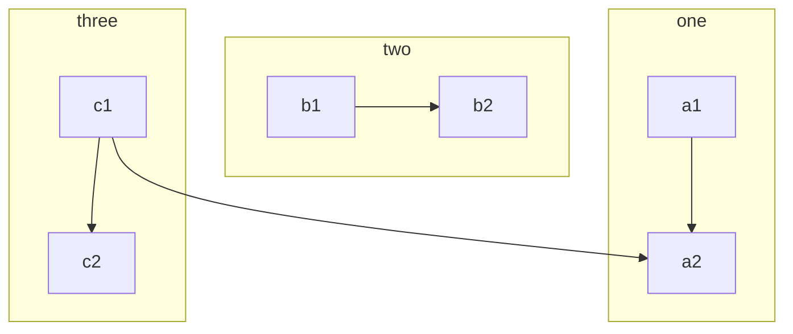
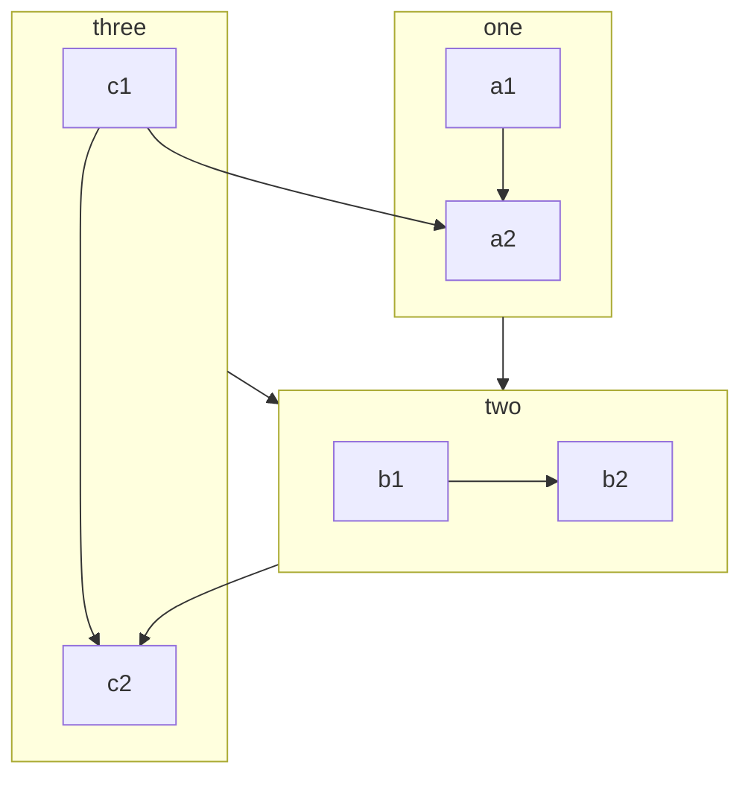
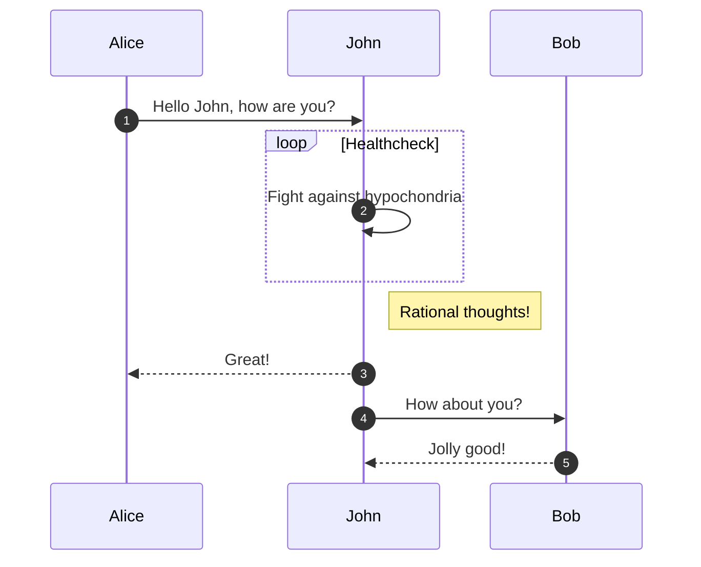
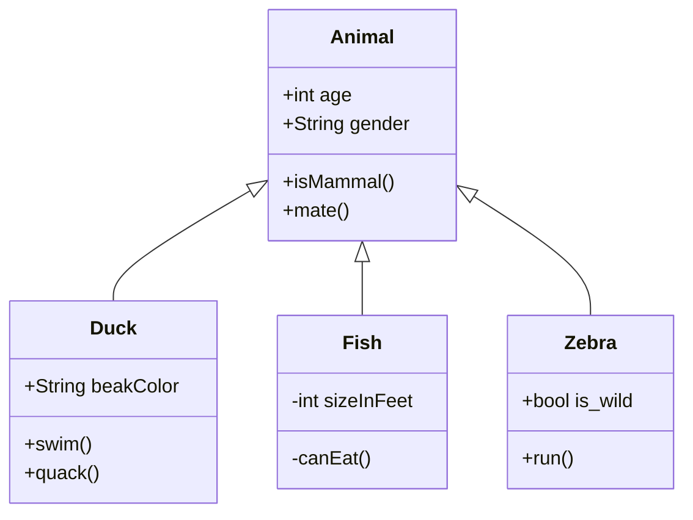
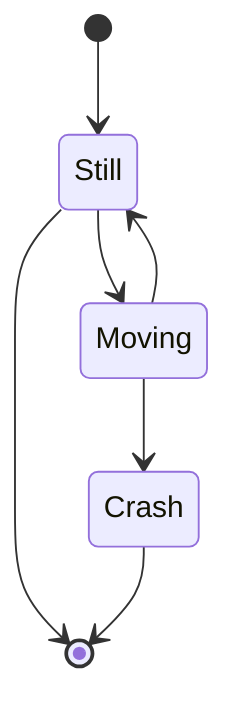
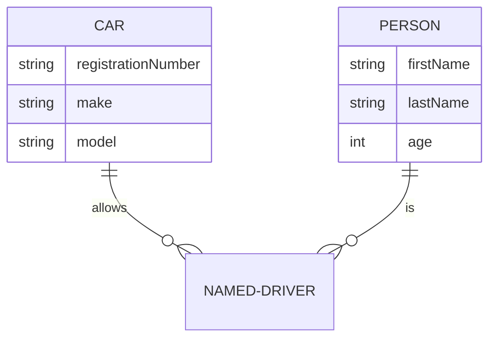
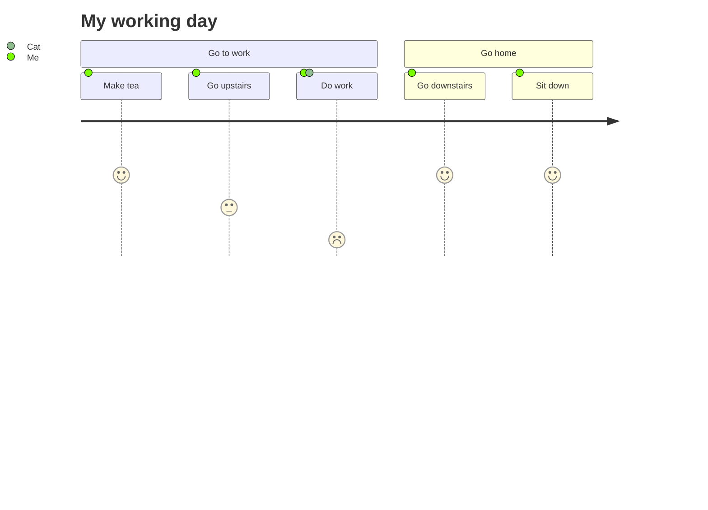
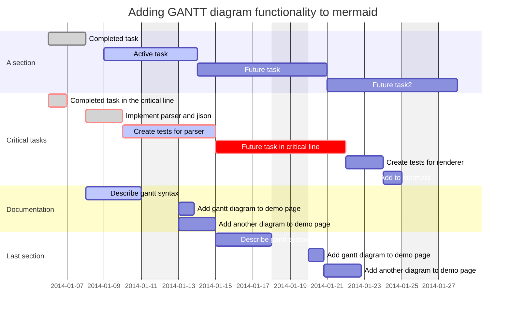
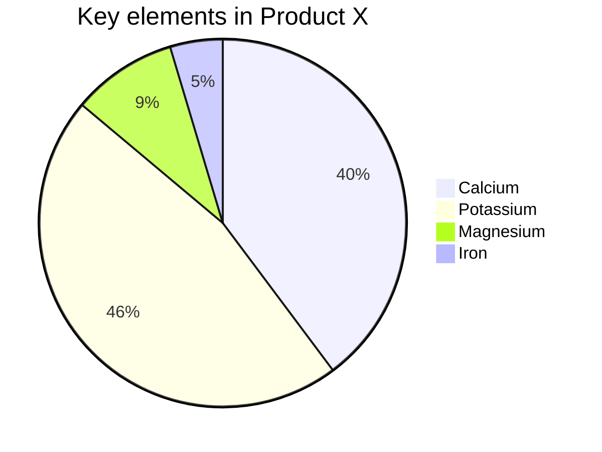

# 图表渲染 —— Mermaid

> [Mermaid](https://mermaid-js.github.io/mermaid/#/)是被广泛接受用于绘制流程图等的一个开源项目, 在此教程部分您将掌握部分mermaid图形绘制的语法, 详细内容请参考mermaid官网以更好使用mermaid绘图

## Flowchart

### Graph

````markdown

````

输出


### flowcharts(Beta)

````markdown

````

输出


## Sequence diagrams

````markdown

````

输出


## Class diagrams

````markdown

````

输出


## State diagrams

````markdown

````

输出


## Entity Relationship Diagrams

````markdown

````

输出


## User Journey Diagram

````markdown

````

输出


## Gantt diagrams

````markdown

````

输出


## Pie chart diagrams

````markdown

````

输出


